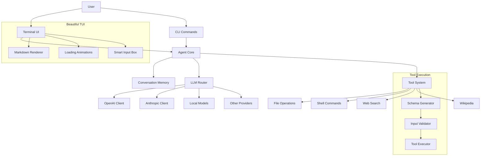

# Simple Agent Go

[](https://go.dev)
[](LICENSE)
[](https://goreportcard.com/report/github.com/nachoal/simple-agent-go)
[](https://github.com/nachoal/simple-agent-go)

A blazing-fast, elegant AI agent framework for Go with a beautiful terminal UI. Build powerful AI assistants that can see, think, and act through a comprehensive tool system while enjoying a delightful developer experience.

## ✨ Features

- 🚀 **Lightning Fast** - Leverages Go's concurrency for parallel tool execution
- 🎨 **Beautiful TUI** - Elegant terminal interface with markdown rendering and animated spinners
- 🤖 **8 LLM Providers** - OpenAI, Anthropic, Google, local models, and more
- 🛠️ **Rich Tool System** - File operations, shell commands, web search, and more
- 📦 **Zero Dependencies** - Single static binary, runs anywhere
- 🎯 **Smart Interactions** - ReAct prompting and native function calling
- ⚡ **Live Streaming** - Real-time response streaming from all providers
- 🎭 **Flexible Modes** - Interactive TUI, one-shot queries, or use as a library

## 🏗️ Architecture



## 🚀 Quick Start

### Installation

```bash
# Install with go
go install github.com/nachoal/simple-agent-go/cmd/simple-agent@latest

# Or download pre-built binaries
curl -L https://github.com/nachoal/simple-agent-go/releases/latest/download/simple-agent-$(uname -s)-$(uname -m) -o simple-agent
chmod +x simple-agent
```

### Configuration

Create a `.env` file:

```bash
# Required for at least one provider
OPENAI_API_KEY=sk-...
ANTHROPIC_API_KEY=sk-ant-...

# Optional providers
GOOGLE_API_KEY=...          # For Gemini models
MOONSHOT_API_KEY=...        # Kimi (Chinese language)
DEEPSEEK_API_KEY=...        # Code-focused
GROQ_API_KEY=...           # Fast inference
PERPLEXITY_API_KEY=...     # Web-aware responses

# For Google Search tool
GOOGLE_API_KEY=...
GOOGLE_CX=...              # Custom Search Engine ID
```

### Basic Usage

```bash
# Start interactive mode (default: OpenAI GPT-4)
simple-agent

# Start interactive mode with unrestricted shell commands (DANGEROUS)
simple-agent --yolo

# Use a specific model
simple-agent --provider anthropic --model claude-3-opus-20240229

# Quick one-shot query
simple-agent query "What files are in the current directory?"

# List available tools
simple-agent tools list
```

## 🎯 Interactive Mode

The TUI provides a delightful chat experience:

- **🎨 Rich Formatting** - Markdown rendering with syntax highlighting
- **⚡ Smart Input** - Auto-expanding textarea that grows with your input
- **🔄 Live Updates** - Animated spinner during processing
- **📜 Natural Scrolling** - Messages flow naturally, no jarring screen clears
- **🎛️ Model Switching** - Change models on the fly with `/model`

### Commands

- `/help` - Show available commands
- `/tools` - List available tools with descriptions
- `/model` - Interactively switch between models
- `/system` - View the current system prompt
- `/verbose` - Toggle debug mode
- `/clear` - Clear conversation (Ctrl+L)
- `/exit` - Exit application (Ctrl+C)

## 🛠️ Built-in Tools

| Tool | Description | Example Use |
|------|-------------|-------------|
| 🧮 **calculate** | Evaluate math expressions | "What's 2^10 + sqrt(144)?" |
| 📄 **file_read** | Read any file | "Show me the contents of main.go" |
| 💾 **file_write** | Create/overwrite files | "Create a Python hello world script" |
| ✏️ **file_edit** | Modify existing files | "Add error handling to that function" |
| 📁 **directory_list** | Browse directories | "What's in the src folder?" |
| 🖥️ **shell** | Run commands (restricted allowlist by default; use `--yolo` to allow any command) | "Show git status" |
| 📚 **wikipedia** | Search Wikipedia | "Tell me about quantum computing" |
| 🔍 **google_search** | Web search (requires API) | "Find the latest Go releases" |

## 🤖 Supported Providers

| Provider | Best For | Popular Models |
|----------|----------|----------------|
| **OpenAI** | General purpose | gpt-4-turbo, gpt-3.5-turbo |
| **Anthropic** | Complex reasoning | claude-3-opus, claude-3-sonnet |
| **Google** | Multimodal tasks | gemini-1.5-pro, gemini-1.5-flash |
| **Moonshot** | Chinese language | moonshot-v1-8k, moonshot-v1-128k |
| **DeepSeek** | Code generation | deepseek-chat, deepseek-coder |
| **Groq** | Fast inference | llama-3-70b, mixtral-8x7b |
| **Perplexity** | Web-aware chat | llama-3.1-sonar-huge-128k-online |
| **Local** | Privacy-focused | Any Ollama/LM Studio model |

## 🔧 Adding Custom Tools

Tools are automatically discovered. Create a new file in `tools/`:

```go
package tools

import (
    "context"
    "encoding/json"
    "fmt"
)

type WeatherTool struct{}

func NewWeatherTool() *WeatherTool {
    return &WeatherTool{}
}

func (t *WeatherTool) Name() string { 
    return "weather" 
}

func (t *WeatherTool) Description() string { 
    return "Get current weather for a city" 
}

func (t *WeatherTool) Execute(ctx context.Context, input string) (string, error) {
    var params struct {
        City string `json:"city" description:"City name"`
    }
    
    if err := json.Unmarshal([]byte(input), &params); err != nil {
        return "", fmt.Errorf("invalid parameters: %w", err)
    }
    
    // Your implementation here
    weather := fmt.Sprintf("The weather in %s is sunny, 22°C", params.City)
    return weather, nil
}

// Register in tools/exports.go
func NewWeatherToolFunc() Tool { return NewWeatherTool() }
```

Then register it in `internal/toolinit/init.go`:

```go
registry.Register("weather", tools.NewWeatherToolFunc)
```

## 🎯 Adding Custom Providers

Implement the `LLMClient` interface:

```go
type MyProvider struct {
    apiKey string
    model  string
}

func (p *MyProvider) StreamCompletion(
    ctx context.Context,
    messages []Message,
) (<-chan StreamChunk, error) {
    // Your implementation
}

func (p *MyProvider) GetAvailableModels(ctx context.Context) ([]Model, error) {
    // Return supported models
}
```

## 📚 Advanced Usage

### As a Library

```go
import (
    "github.com/nachoal/simple-agent-go/agent"
    "github.com/nachoal/simple-agent-go/llm/openai"
)

// Create client
client, _ := openai.NewClient(
    openai.WithModel("gpt-4-turbo-preview"),
    openai.WithTemperature(0.7),
)

// Create agent
ag := agent.New(client,
    agent.WithMaxIterations(10),
    agent.WithSystemPrompt("You are a helpful assistant"),
)

// Query
response, _ := ag.Query(ctx, "What's the weather like?")
fmt.Println(response.Content)
```

### Custom System Prompts

```go
const myPrompt = `You are an expert Go developer.
Always write idiomatic Go code with proper error handling.
Focus on clarity and performance.`

ag := agent.New(client, agent.WithSystemPrompt(myPrompt))
```

## 🏃 Performance

- **Concurrent Tool Execution** - Tools run in parallel when possible
- **Streaming Responses** - Immediate feedback, no waiting
- **Minimal Memory Footprint** - Efficient memory usage
- **Fast Startup** - < 100ms to interactive prompt

## 🧪 Development

```bash
# Clone the repository
git clone https://github.com/nachoal/simple-agent-go
cd simple-agent-go

# Install dependencies
go mod download

# Run tests
make test

# Build
make build

# Install locally
make install
```

### Project Structure

```
simple-agent-go/
├── cmd/simple-agent/    # CLI entry point
├── agent/               # Core agent logic
├── llm/                # LLM provider implementations
├── tools/              # Built-in tools
├── tui/                # Terminal UI components
├── config/             # Configuration management
└── internal/           # Internal packages
```

## 📄 License

MIT License - see [LICENSE](LICENSE) file for details.

## 🤝 Contributing

Contributions are welcome! Please feel free to submit a Pull Request. Areas of interest:

- 🤖 New LLM providers
- 🛠️ Additional tools
- 🎨 TUI enhancements
- 📚 Documentation improvements
- 🧪 Test coverage

## 🙏 Acknowledgments

Built with love using these amazing libraries:
- [Bubble Tea](https://github.com/charmbracelet/bubbletea) - Terminal UI framework
- [Glamour](https://github.com/charmbracelet/glamour) - Markdown rendering
- [Cobra](https://github.com/spf13/cobra) - CLI framework
- [Lipgloss](https://github.com/charmbracelet/lipgloss) - Terminal styling

---

<p align="center">
  Made with ❤️ by <a href="https://github.com/nachoal">@nachoal</a>
</p>
